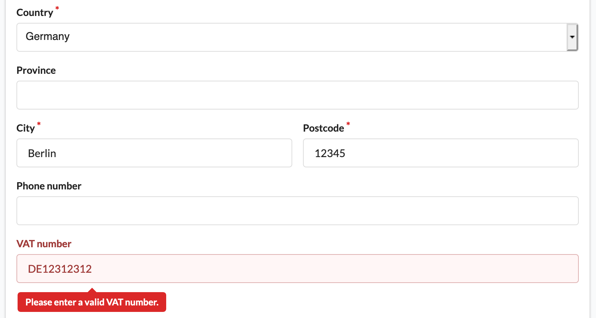
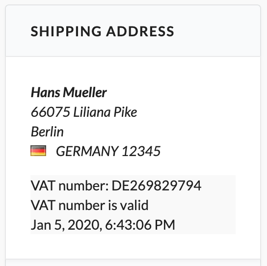

# Sylius VAT number and rates plugin

[![Latest Version on Packagist][ico-version]][link-packagist]
[![Software License][ico-license]](LICENSE)
[![Build][ico-build]][link-build]
[![Quality Score][ico-code-quality]][link-code-quality]

## Features
 * New fields for VAT number and validation status at `Address` entity
 * Validate VAT numbers (by format, country and existence) 
    * Using [VIES API](http://ec.europa.eu/taxation_customs/vies/) for EU VAT number validation
 * Revalidate customers VAT numbers after a given time
 * Installer for EU VAT rates with countries and zones
 * Placing an order in the EU without VAT if
    * Customers billing country is different from shop billing data
    * VAT number validation was successful

## Installation

### Download the plugin via composer
```bash
composer require gewebe/sylius-vat-plugin
```

### Enable the plugin in bundles.php
```php
# config/bundles.php

return [
    # ...
    
    Gewebe\SyliusVATPlugin\GewebeSyliusVATPlugin::class => ['all' => true],
];
```

### Import the plugin configurations
```yaml
# config/packages/_sylius.yaml

imports:
    # ...
       
    - { resource: '@GewebeSyliusVATPlugin/config/app/config.yml'}
```

### Copy templates
Copy customized templates to your templates directory (e.g `templates/bundles/`):

```bash
mkdir -p templates/bundles/SyliusAdminBundle/
cp -R vendor/gewebe/sylius-vat-plugin/src/templates/SyliusAdminBundle/* templates/bundles/SyliusAdminBundle/
mkdir -p templates/bundles/SyliusShopBundle/
cp -R vendor/gewebe/sylius-vat-plugin/src/templates/SyliusShopBundle/* templates/bundles/SyliusShopBundle/
```

### Extend `Address` entity

- If you use `annotations` mapping:

```php
# src/Entity/Addressing/Address.php

namespace App\Entity\Addressing;

use Doctrine\ORM\Mapping as ORM;
use Gewebe\SyliusVATPlugin\Entity\VatNumberAddressInterface;
use Gewebe\SyliusVATPlugin\Entity\VatNumberAwareTrait;
use Sylius\Component\Core\Model\Address as BaseAddress;

/**
 * @ORM\Entity
 * @ORM\Table(name="sylius_address")
 */
class Address extends BaseAddress implements VatNumberAddressInterface
{
    use VatNumberAwareTrait;
```

- If you use `yaml` mapping add also:

```yaml
# config/doctrine/Address.orm.yaml

App\Entity\Addressing\Address:
    type: entity
    table: sylius_address
    fields:
        vatNumber:
            type: string
            column: vat_number
            nullable: true
        vatValid:
            type: boolean
            column: vat_valid
        vatValidatedAt:
            type: datetime
            column: vat_validated_at
            nullable: true
```

### Update your database schema

```bash
bin/console doctrine:migrations:diff
bin/console doctrine:migrations:migrate
```

## Usage

### Install EU countries and VAT rates

```bash
# EU VAT on digital services (MOSS scheme)
bin/console vat:install:eu

# EU with French VAT (cross-border)
bin/console vat:install:eu FR

# EU with French VAT and passed threshold in Spain and Portugal (cross-border)
bin/console vat:install:eu FR -t ES,PT

# EU with French VAT included in price
bin/console vat:install:eu FR -i

# EU with German standard and reduced VAT categories
bin/console vat:install:eu DE -c standard,reduced
```

### Validate customers VAT number

##### 1. Create new order with VAT number at shipping address


##### 2. Show VAT number and validation status at admin orders



## Testing

Setup Traditional
```bash
$ composer install
$ cd tests/Application
$ yarn install
$ yarn build
$ bin/console assets:install public -e test
$ bin/console doctrine:schema:create -e test

$ export APP_ENV=test
$ symfony server:start --port=8080 --dir=public
```

Setup Docker
```bash
$ docker compose up -d
$ docker compose exec app make init
```

Run Tests
```bash
$ vendor/bin/behat
$ vendor/bin/phpspec run
$ vendor/bin/phpstan analyse -c phpstan.neon -l max src/
$ vendor/bin/psalm
```

Coding Standard
```bash
$ vendor/bin/ecs check
```

[ico-version]: https://img.shields.io/packagist/v/gewebe/sylius-vat-plugin.svg?style=flat-square
[ico-license]: https://img.shields.io/badge/license-MIT-brightgreen.svg?style=flat-square
[ico-code-quality]: https://img.shields.io/scrutinizer/g/gewebe/SyliusVATPlugin.svg?style=flat-square
[ico-build]: https://github.com/gewebe/SyliusVATPlugin/actions/workflows/build.yml/badge.svg

[link-packagist]: https://packagist.org/packages/gewebe/sylius-vat-plugin
[link-code-quality]: https://scrutinizer-ci.com/g/gewebe/SyliusVATPlugin
[link-build]: https://github.com/gewebe/SyliusVATPlugin/actions/workflows/build.yml
