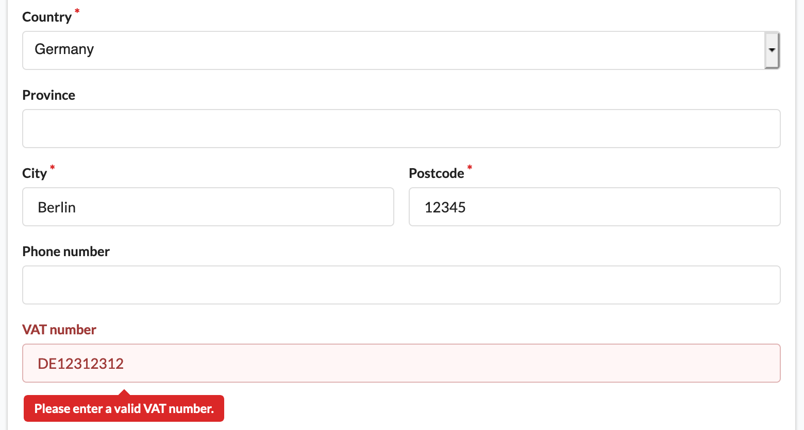
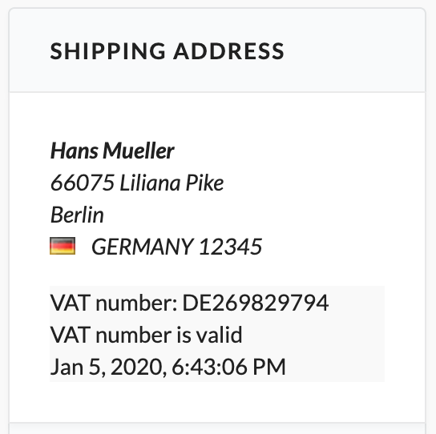

# Sylius VAT number and rates plugin

[![Latest Version on Packagist][ico-version]][link-packagist]
[![Software License][ico-license]](LICENSE)
[![Build][ico-build]][link-build]
[![Quality Score][ico-code-quality]][link-code-quality]

## Features
 * Installer for EU VAT rates with countries and zones
 * New fields for VAT number at `Address` and `ShopBillingData` entity
 * Configure VAT number field requirement:
    * Optional / Required
    * Required if customer filled “Company” field
    * Required in selected countries
 * Validate VAT number:
    * Format for selected country
    * Country is same as selected country
    * Valid EU registration via [VIES API](http://ec.europa.eu/taxation_customs/vies/)
    * Valid UK (GB) registration via [HMRC API](https://developer.service.hmrc.gov.uk/api-documentation/docs/api/service/vat-registered-companies-api)
 * Revalidate customers VAT numbers after a given time
 * Placing an order without VAT in the EU, if
    * VAT number validation was successful
    * Customers taxation country is different from shop billing country

## Installation

### Download the plugin via composer
```bash
composer require gewebe/sylius-vat-plugin
```

### Enable the plugin in bundles.php
```php
# config/bundles.php

return [
    # ...
    
    Gewebe\SyliusVATPlugin\GewebeSyliusVATPlugin::class => ['all' => true],
];
```

### Import the plugin configurations
```yaml
# config/packages/_sylius.yaml

imports:
    # ...
       
    - { resource: '@GewebeSyliusVATPlugin/config/config.yaml'}
```

### Configure taxation address

For EU VAT, the address for taxation should be set to the shipping address in the Sylius configuration.
```yaml
# config/packages/_sylius.yaml

sylius_core:
    shipping_address_based_taxation: true
```

### Extend `Address` entity

```php
# src/Entity/Addressing/Address.php

namespace App\Entity\Addressing;

use Doctrine\ORM\Mapping as ORM;
use Gewebe\SyliusVATPlugin\Entity\VatNumberAddressInterface;
use Gewebe\SyliusVATPlugin\Entity\VatNumberAwareTrait;
use Sylius\Component\Core\Model\Address as BaseAddress;

#[ORM\Entity]
#[ORM\Table(name: 'sylius_address')]
class Address extends BaseAddress implements VatNumberAddressInterface
{
    use VatNumberAwareTrait;
```

If you use `yaml` mapping add also:
```yaml
# config/doctrine/Address.orm.yaml

App\Entity\Addressing\Address:
    type: entity
    table: sylius_address
    fields:
        vatNumber:
            type: string
            column: vat_number
            nullable: true
        vatValid:
            type: boolean
            column: vat_valid
        vatValidatedAt:
            type: datetime
            column: vat_validated_at
            nullable: true
```

### Add or Extend `ShopBillingData` entity

```php
# src/Entity/Channel/ShopBillingData.php

namespace App\Entity\Channel;

use Doctrine\ORM\Mapping as ORM;
use Gewebe\SyliusVATPlugin\Entity\ShopBillingDataVatNumberAwareTrait;
use Gewebe\SyliusVATPlugin\Entity\ShopBillingDataVatNumberInterface;
use Sylius\Component\Core\Model\ShopBillingData as BaseShopBillingData;

#[ORM\Entity]
#[ORM\Table(name: 'sylius_shop_billing_data')]
class ShopBillingData extends BaseShopBillingData implements ShopBillingDataVatNumberInterface
{
    use ShopBillingDataVatNumberAwareTrait;
```

If you use `yaml` mapping add also:
```yaml
# config/doctrine/ShopBillingData.orm.yaml

App\Entity\Channel\ShopBillingData:
    type: entity
    table: sylius_shop_billing_data
    fields:
        vatNumber:
            type: string
            column: vat_number
            nullable: true
```

Override the resource for `shop_billing_data` in your sylius config:
```yaml
# config/packages/_sylius.yaml

sylius_core:
    resources:
        shop_billing_data:
            classes:
                model: App\Entity\Channel\ShopBillingData
```

### Update your database schema

```bash
bin/console doctrine:migrations:diff
bin/console doctrine:migrations:migrate
```

## Usage

### Install EU countries and VAT rates

```bash
# EU VAT on digital services (MOSS scheme)
bin/console vat:install:eu

# EU with French VAT (cross-border)
bin/console vat:install:eu FR

# EU with French VAT and passed threshold in Spain and Portugal (cross-border)
bin/console vat:install:eu FR -t ES,PT

# EU with French VAT included in price
bin/console vat:install:eu FR -i

# EU with German standard and reduced VAT categories
bin/console vat:install:eu DE -c standard,reduced
```

### Validate customers VAT number

##### 1. Create new order with VAT number at shipping address


##### 2. Show VAT number and validation status at admin orders


### Validate UK VAT numbers with the HMRC API

VAT numbers of addresses in the United Kingdom (country code `GB`) are validated against the
[HMRC "Check a UK VAT number" API](https://developer.service.hmrc.gov.uk/api-documentation/docs/api/service/vat-registered-companies-api/2.0/oas/page)
Version 2 of the API. 

Configure the credentials and, optionally, the API base URL in the application config:

```yaml
# config/packages/_sylius.yaml

gewebe_sylius_vat:
    hmrc:
        base_url: 'https://api.service.hmrc.gov.uk'  # https://test-api.service.hmrc.gov.uk for the sandbox
        client_id: '%env(HMRC_CLIENT_ID)%'
        client_secret: '%env(HMRC_CLIENT_SECRET)%'
```

Accepted UK VAT number formats are standard (`GB123456789`), branch traders (`GB123456789001`), government
departments (`GBGD001`) and health authorities (`GBHA599`); the `GB` prefix is optional.
Government department and health authority numbers cannot be looked up online and are therefore
only checked for their format.


## Testing

### Traditional

1. From the plugin skeleton root directory, run the following commands:

    ```bash
    (cd vendor/sylius/test-application && yarn install)
    (cd vendor/sylius/test-application && yarn build)
    vendor/bin/console assets:install
   
    vendor/bin/console doctrine:database:create
    vendor/bin/console doctrine:migrations:migrate -n
    # Optionally load data fixtures
    vendor/bin/console sylius:fixtures:load -n
    ```

To be able to set up a plugin's database, remember to configure your database credentials in `tests/TestApplication/.env` and `tests/TestApplication/.env.test`.

2. Run your local server:

    ```bash
    symfony server:ca:install
    symfony server:start -d
    ```

3. Open your browser and navigate to `https://localhost:8000`.

### Docker

1. Execute `make init` to initialize the container and install the dependencies.

2. Execute `make database-init` to create the database and run migrations.

3. (Optional) Execute `make load-fixtures` to load the fixtures.

4. Your app is available at `http://localhost`.

## Usage

### Running plugin tests

- PHPUnit

  ```bash
  vendor/bin/phpunit
  ```

- Behat (non-JS scenarios)

  ```bash
  vendor/bin/behat --strict --tags="~@javascript&&~@mink:chromedriver"
  ```

- PHPStan - Static Analysis

  ```bash
  vendor/bin/phpstan analyse -c phpstan.neon -l max src/  
  ```

- Coding Standard
  
  ```bash
  vendor/bin/ecs check
  ```

[ico-version]: https://img.shields.io/packagist/v/gewebe/sylius-vat-plugin.svg?style=flat-square
[ico-license]: https://img.shields.io/badge/license-MIT-brightgreen.svg?style=flat-square
[ico-code-quality]: https://img.shields.io/scrutinizer/g/gewebe/SyliusVATPlugin.svg?style=flat-square
[ico-build]: https://github.com/gewebe/SyliusVATPlugin/actions/workflows/build.yaml/badge.svg

[link-packagist]: https://packagist.org/packages/gewebe/sylius-vat-plugin
[link-code-quality]: https://scrutinizer-ci.com/g/gewebe/SyliusVATPlugin
[link-build]: https://github.com/gewebe/SyliusVATPlugin/actions/workflows/build.yaml
